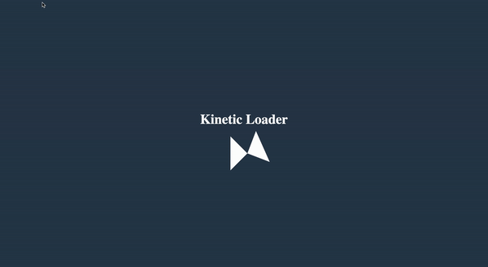

# 50 Projects in 50 Days - Kinetic Loader

This is a code along project in the [50 Projects In 50 Days - HTML, CSS & JavaScript Udemy Course](https://www.udemy.com/course/50-projects-50-days/). Sharpen your skills by building 50 quick, unique & fun mini projects.

## Table of contents 😌

- [Overview](#overview)
  - [The project](#the-project)
  - [Screenshot](#screenshot)
  - [Links](#links)
- [My process](#my-process)
  - [Built with](#built-with)
  - [What I learned](#what-i-learned)
  - [Continued development](#continued-development)
  - [Code snippets](#im-really-proud-of-these-code-snippets%EF%B8%8F)
  - [Useful resources](#useful-resources)
- [Author](#author)
- [Acknowledgments](#acknowledgments)

## Overview👋🏾

Welcome to the 23<sup>rd</sup> mini-project of the course!

### The project😥

In this project users will be able to:

- Build a responsive site that displays a functional progress bar.

### Screenshot🌇



### Links👩🏾‍💻

- Live Site URL: (https://warm-liger-29b338.netlify.app/)

## My process💭

This is a quick project that I started by marking out initial structure and classes in HTML. Next I finalized the UI by styling the CSS. I built the triangles by styling the section using the before and after pseudo classes. I then added animation by way of the @keyframes CSS at rule.

### Built with👷🏾‍♀️

- Semantic HTML5 markup
- CSS custom properties
- Flexbox

### What I learned👩🏾‍🏫

I learned how to create animation by using the @keyframes CSS at rule to control the steps in the animation sequence.

I also learned that when using the before or after selectors you MUST add content for the style to be visible.

### Continued development🔮

This project could be utilized later on as a loading animation on a site.

I also plan on continuing to learn the best ways to phrase git commits, so that future viewers can fully understand the changes that have occurred.

### I'm really proud of these code snippets✂️

```css
.kinetic::after,
.kinetic::before {
  content: '';
  position: absolute;
  top: 0;
  left: 0;
  /* creating triangle */
  width: 0;
  height: 0;
  border: 50px solid transparent;
  border-bottom-color: #fff;
  /* 2s duration, linear fashion, running infinitely, delay .5s  */
  animation: rotateA 2s linear infinite 0.5s;
}

.kinetic::before {
  transform: rotate(90deg);
  animation: rotateB 2s linear infinite;
}

@keyframes rotateA {
  0%,
  25% {
    transform: rotate(0deg);
  }

  50%,
  75% {
    transform: rotate(180deg);
  }

  100% {
    transform: rotate(360deg);
  }
}

@keyframes rotateB {
  0%,
  25% {
    transform: rotate(90deg);
  }

  50%,
  75% {
    transform: rotate(270deg);
  }

  100% {
    transform: rotate(450deg);
  }
}
```


### Useful resources📖

- [Resource](https://developer.mozilla.org/en-US/docs/Web/CSS/@keyframes) - This is an amazing article which broke down the @keyframes CSS at rule.

## Author🔎

- Website - [Portfolio Site](https://maiannethornton.netlify.app/)
- Frontend Mentor - [@MaianneThornton](https://www.frontendmentor.io/profile/MaianneThornton)
- GitHub - [@MaianneThornton](GitHub.com/MaianneThornton)
- Twitter - [@MaianneThornton](https://twitter.com/MaianneThornton)
- LinkedIn - [@MaianneThornton](https://www.linkedin.com/in/maiannethornton/)

## Acknowledgments🙏🏾

Special Thanks go to [Brad Traversy](http://www.traversymedia.com/) and [Florin Pop](http://www.florin-pop.com/) creating the course and making reviewing concepts fun 😊.
